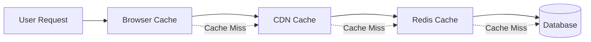

# Design Document

## Overview

This design document outlines the technical architecture and implementation strategy for transforming PolitiFind into an advanced, bug-free political information platform. The design emphasizes scalability, reliability, performance, and user experience while maintaining the existing Next.js/Supabase foundation.

## Architecture

### High-Level System Architecture

```mermaid
graph TB
    subgraph "Client Layer"
        PWA[Progressive Web App]
        Mobile[Mobile Interface]
        Desktop[Desktop Interface]
    end
    
    subgraph "API Gateway & Load Balancer"
        Gateway[API Gateway]
        LB[Load Balancer]
    end
    
    subgraph "Application Layer"
        NextJS[Next.js App Router]
        API[API Routes]
        Middleware[Custom Middleware]
    end
    
    subgraph "Service Layer"
        Auth[Auth Service]
        Search[Search Service]
        Analytics[Analytics Service]
        Notification[Notification Service]
        Cache[Cache Service]
        AI[AI Service]
    end
    
    subgraph "Data Layer"
        Supabase[(Supabase PostgreSQL)]
        Redis[(Redis Cache)]
        Search_DB[(Elasticsearch)]
        CDN[CDN Storage]
    end
    
    subgraph "External Services"
        GoogleAI[Google AI/Genkit]
        NewsAPI[News APIs]
        GovData[Government Data Sources]
    end
    
    PWA --> Gateway
    Mobile --> Gateway
    Desktop --> Gateway
    Gateway --> LB
    LB --> NextJS
    NextJS --> API
    API --> Service Layer
    Service Layer --> Data Layer
    Service Layer --> External Services
```

### Technology Stack Enhancement

**Core Framework (Existing)**
- Next.js 15.3.3 with App Router
- React 18 with TypeScript 5
- Supabase for backend services

**New Additions**
- **In-memory caching** - Multi-level caching using Map/LRU cache
- **PostgreSQL Full-Text Search** - Advanced search capabilities using built-in features
- **Native WebSocket/Supabase Realtime** - Real-time communication
- **Custom job queue** - Background job processing using setTimeout/setInterval
- **Custom error tracking** - Error monitoring using local logging and database storage
- **Custom Service Worker** - PWA and offline capabilities
- **React Query/TanStack Query** - Data fetching and caching
- **Framer Motion** - Enhanced animations and interactions

## Components and Interfaces

### 1. Real-time Data Synchronization System

**WebSocket Manager**
```typescript
interface WebSocketManager {
  connect(): Promise<void>;
  subscribe(channel: string, callback: (data: any) => void): void;
  unsubscribe(channel: string): void;
  broadcast(channel: string, data: any): void;
  handleReconnection(): void;
}
```

**Real-time Event System**
```typescript
interface RealtimeEvent {
  type: 'politician_update' | 'news_update' | 'system_notification';
  payload: any;
  timestamp: Date;
  userId?: string;
  broadcast: boolean;
}
```

**Implementation Strategy:**
- Use Supabase Realtime for database changes
- Implement custom WebSocket layer for complex real-time features
- Create event-driven architecture with pub/sub patterns
- Add connection resilience with automatic reconnection

### 2. Advanced Search and AI System

**Search Service Interface**
```typescript
interface SearchService {
  search(query: SearchQuery): Promise<SearchResult>;
  suggest(partial: string): Promise<Suggestion[]>;
  recommend(userId: string, context: RecommendationContext): Promise<Politician[]>;
  indexPolitician(politician: Politician): Promise<void>;
  updateIndex(): Promise<void>;
}

interface SearchQuery {
  text: string;
  filters: SearchFilters;
  location?: GeoLocation;
  userId?: string;
  limit: number;
  offset: number;
}
```

**AI Recommendation Engine**
```typescript
interface RecommendationEngine {
  generateRecommendations(userId: string): Promise<Recommendation[]>;
  updateUserProfile(userId: string, interaction: UserInteraction): void;
  trainModel(data: TrainingData[]): Promise<void>;
  getPersonalizedContent(userId: string): Promise<PersonalizedContent>;
}
```

**Implementation Strategy:**
- Use PostgreSQL full-text search with tsvector and tsquery for advanced search
- Implement similarity matching using PostgreSQL trigram functions
- Create simple recommendation system using user behavior analysis
- Add basic natural language processing using text parsing and keyword extraction

### 3. Error Handling and Recovery System

**Error Handler Interface**
```typescript
interface ErrorHandler {
  handleError(error: AppError): Promise<ErrorResponse>;
  retry<T>(operation: () => Promise<T>, options: RetryOptions): Promise<T>;
  circuitBreaker<T>(operation: () => Promise<T>, config: CircuitBreakerConfig): Promise<T>;
  logError(error: Error, context: ErrorContext): void;
}

interface RetryOptions {
  maxAttempts: number;
  backoffStrategy: 'exponential' | 'linear' | 'fixed';
  baseDelay: number;
  maxDelay: number;
}
```

**Resilience Patterns**
- Circuit Breaker pattern for external API calls
- Exponential backoff for retry logic
- Graceful degradation for non-critical features
- Comprehensive error logging and monitoring

### 4. Performance Optimization System

**Cache Manager**
```typescript
interface CacheManager {
  get<T>(key: string): Promise<T | null>;
  set<T>(key: string, value: T, ttl?: number): Promise<void>;
  invalidate(pattern: string): Promise<void>;
  warmup(keys: string[]): Promise<void>;
  getStats(): CacheStats;
}
```

**Performance Monitor**
```typescript
interface PerformanceMonitor {
  trackPageLoad(page: string, metrics: WebVitals): void;
  trackAPICall(endpoint: string, duration: number, status: number): void;
  trackUserInteraction(action: string, duration: number): void;
  generateReport(): PerformanceReport;
}
```

**Optimization Strategies:**
- Multi-level caching (Browser → Memory Cache → Database)
- Image optimization with WebP/AVIF formats using Next.js built-in optimization
- Code splitting and lazy loading using React.lazy and dynamic imports
- Preloading critical resources using Next.js prefetching
- Custom Service Worker for offline caching

### 5. Analytics and Insights System

**Analytics Engine**
```typescript
interface AnalyticsEngine {
  trackEvent(event: AnalyticsEvent): void;
  generateInsights(timeRange: TimeRange): Promise<Insights>;
  createDashboard(config: DashboardConfig): Promise<Dashboard>;
  exportData(format: ExportFormat, filters: AnalyticsFilters): Promise<ExportResult>;
}

interface PoliticalInsights {
  popularityTrends: TrendData[];
  engagementMetrics: EngagementData;
  geographicDistribution: GeoData[];
  predictiveAnalytics: PredictionData;
}
```

**Visualization Components:**
- Interactive charts using Recharts and D3.js
- Real-time data visualization
- Customizable dashboard widgets
- Export capabilities for reports

### 6. Security and Privacy System

**Security Manager**
```typescript
interface SecurityManager {
  authenticateUser(credentials: AuthCredentials): Promise<AuthResult>;
  authorizeAction(userId: string, action: string, resource: string): Promise<boolean>;
  encryptData(data: any): string;
  decryptData(encryptedData: string): any;
  auditLog(action: AuditAction): void;
}

interface PrivacyManager {
  anonymizeData(data: PersonalData): AnonymizedData;
  handleDataRequest(userId: string, requestType: DataRequestType): Promise<DataResponse>;
  enforceRetention(policy: RetentionPolicy): Promise<void>;
  generatePrivacyReport(): PrivacyReport;
}
```

**Security Measures:**
- JWT tokens with refresh mechanism
- Rate limiting and DDoS protection
- Data encryption at rest and in transit
- RBAC (Role-Based Access Control)
- Security headers and CSP policies

### 7. Progressive Web App System

**PWA Manager**
```typescript
interface PWAManager {
  installPrompt(): Promise<boolean>;
  updateServiceWorker(): Promise<void>;
  syncOfflineData(): Promise<void>;
  handlePushNotification(notification: PushNotification): void;
  cacheStrategy(request: Request): Promise<Response>;
}
```

**Offline Capabilities:**
- Service Worker with caching strategies
- Background sync for data updates
- Offline-first architecture for critical features
- Push notifications for important updates

## Data Models

### Enhanced Politician Model
```typescript
interface EnhancedPolitician extends Politician {
  // Real-time data
  lastUpdated: Date;
  changeHistory: ChangeRecord[];
  
  // Analytics data
  popularityScore: number;
  engagementMetrics: EngagementMetrics;
  trendingStatus: TrendingStatus;
  
  // Search optimization
  searchKeywords: string[];
  searchVector: number[];
  
  // AI-generated content
  aiSummary: string;
  aiInsights: AIInsight[];
  
  // Performance data
  viewCount: number;
  shareCount: number;
  favoriteCount: number;
}
```

### User Interaction Model
```typescript
interface UserInteraction {
  id: string;
  userId: string;
  type: InteractionType;
  targetId: string;
  targetType: 'politician' | 'article' | 'search';
  timestamp: Date;
  metadata: Record<string, any>;
  sessionId: string;
  deviceInfo: DeviceInfo;
}
```

### Analytics Event Model
```typescript
interface AnalyticsEvent {
  eventId: string;
  eventType: string;
  userId?: string;
  sessionId: string;
  timestamp: Date;
  properties: Record<string, any>;
  context: EventContext;
}
```

## Error Handling

### Error Classification System
```typescript
enum ErrorSeverity {
  LOW = 'low',
  MEDIUM = 'medium',
  HIGH = 'high',
  CRITICAL = 'critical'
}

interface AppError extends Error {
  code: string;
  severity: ErrorSeverity;
  context: ErrorContext;
  recoverable: boolean;
  userMessage: string;
}
```

### Error Recovery Strategies
1. **Network Errors**: Retry with exponential backoff, fallback to cached data
2. **Database Errors**: Circuit breaker pattern, read replicas for queries
3. **API Errors**: Graceful degradation, alternative data sources
4. **UI Errors**: Error boundaries, fallback components
5. **Authentication Errors**: Token refresh, re-authentication flow

## Testing Strategy

### Testing Pyramid
1. **Unit Tests** (70%)
   - Component testing with React Testing Library
   - Service layer testing with Jest
   - Utility function testing

2. **Integration Tests** (20%)
   - API endpoint testing
   - Database integration testing
   - Third-party service integration testing

3. **End-to-End Tests** (10%)
   - Critical user journey testing with Playwright
   - Cross-browser compatibility testing
   - Performance testing

### Testing Tools and Frameworks
- **Jest** - Unit and integration testing
- **React Testing Library** - Component testing
- **Playwright** - E2E testing
- **MSW (Mock Service Worker)** - API mocking
- **Lighthouse CI** - Performance testing
- **Axe** - Accessibility testing

### Quality Assurance
- Pre-commit hooks with Husky
- Automated testing in CI/CD pipeline
- Code coverage requirements (>80%)
- Performance budgets and monitoring
- Security scanning with Snyk

## Performance Optimization

### Caching Strategy


### Loading Optimization
1. **Critical Resource Prioritization**
   - Above-the-fold content first
   - Progressive image loading
   - Font optimization with font-display: swap

2. **Code Splitting**
   - Route-based splitting
   - Component-based splitting
   - Dynamic imports for heavy features

3. **Asset Optimization**
   - Image compression and modern formats
   - CSS and JS minification
   - Tree shaking for unused code

### Monitoring and Metrics
- Core Web Vitals tracking
- Real User Monitoring (RUM)
- Synthetic performance testing
- Database query optimization
- API response time monitoring

This design provides a comprehensive foundation for implementing all the advanced features while maintaining system reliability and performance. The architecture is scalable, maintainable, and follows modern best practices for web application development.